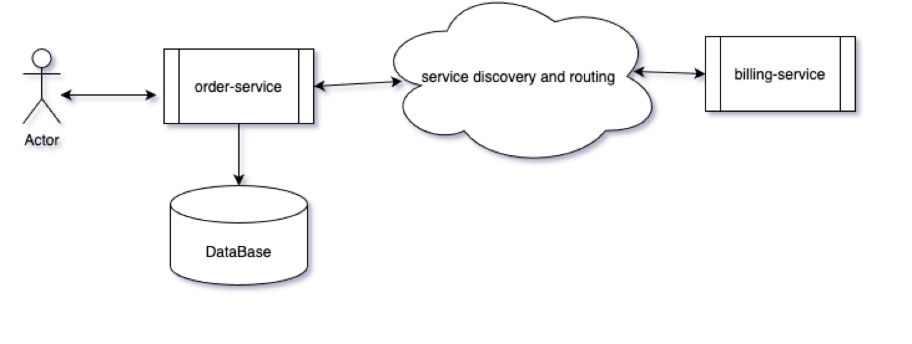

== chaos-monkey-order-service 

This projects helps demonstrate the chaos monkey for Spring Boot/Java apps developed in micro-services style.
This is first of the 2 services OrderService to demo the SpringBoot Chaos Monkey as per the following design.





----
Java 
SpringBoot 
Embedded H2
chaos-monkey-spring-boot

python
chaos-toolkit
----

The code for billing-service in this figure can be found at : https://github.com/sdbawa/chaos-monkey-billing-service

Order-Service makes a HTTP call to billing-service using  HTTP client.

== What you'll build
You'll build Spring Boot app in Java, Spring Boot, and H2 DB that spins the following 2 services. 

----
GET http://localhost:8080/order-svc/order-billing-status/1
GET http://localhost:8080/order-svc/all-orders
----


== What you'll need

```
java_version: 11
spring-boot : 2.4.3
chaos-monkey-spring-boot : 2.5.1
```

